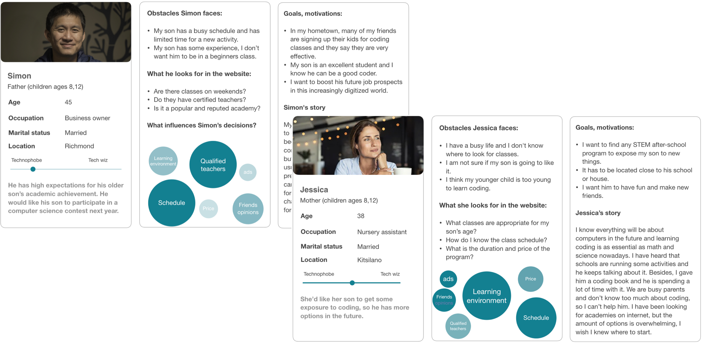
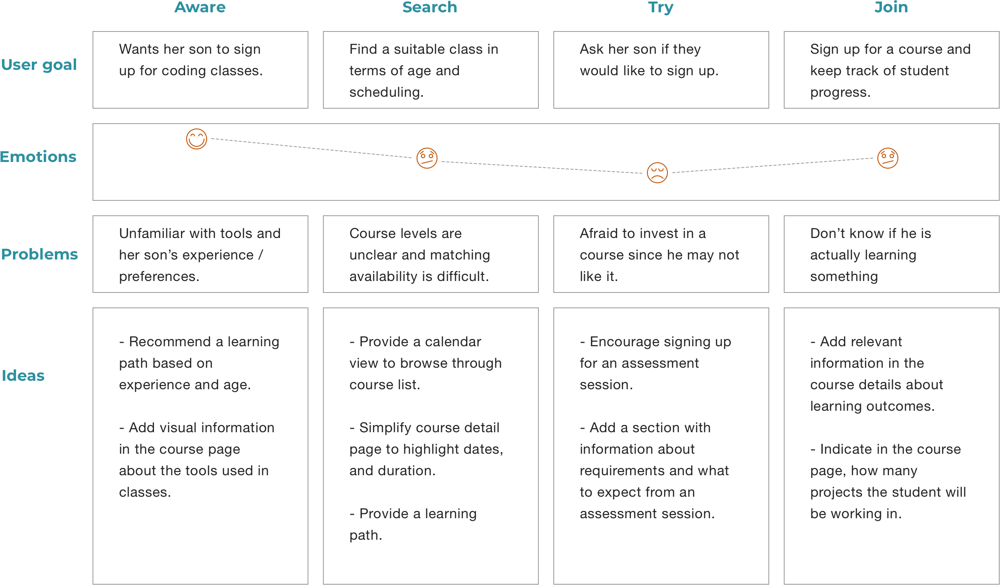
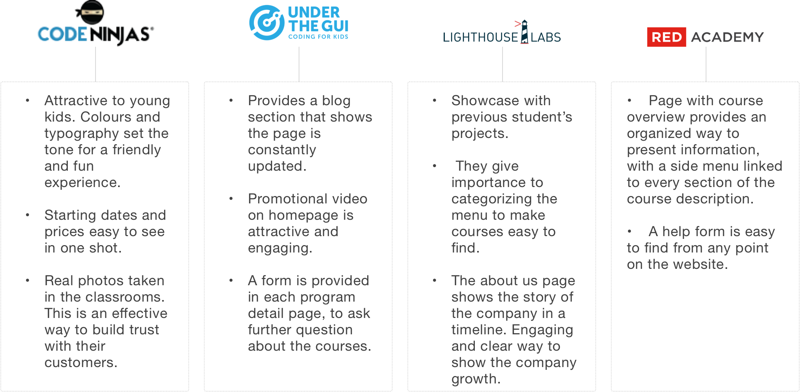
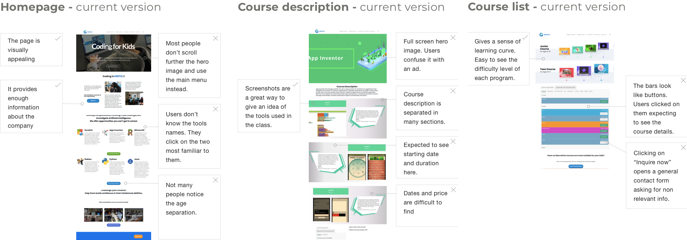
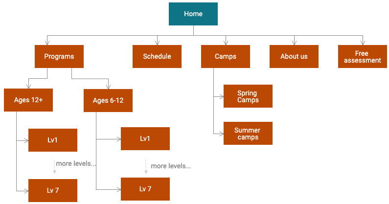
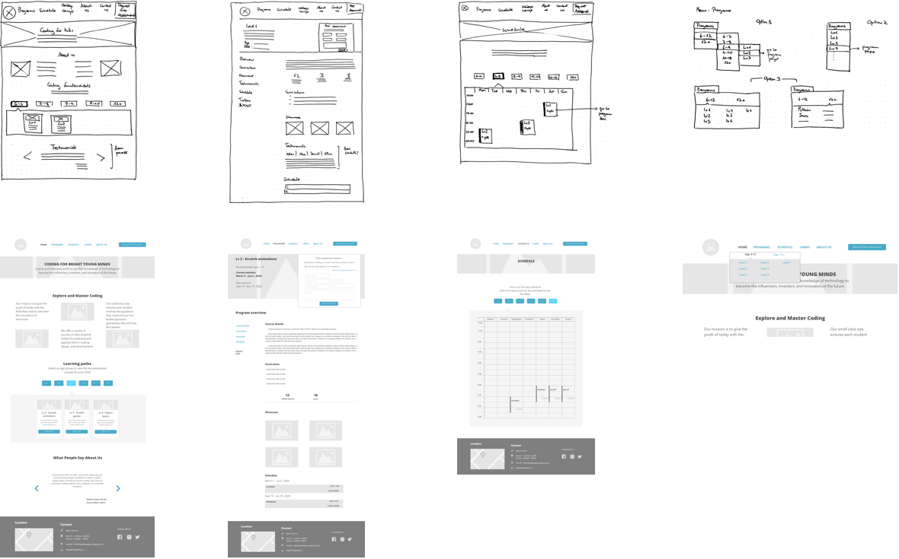
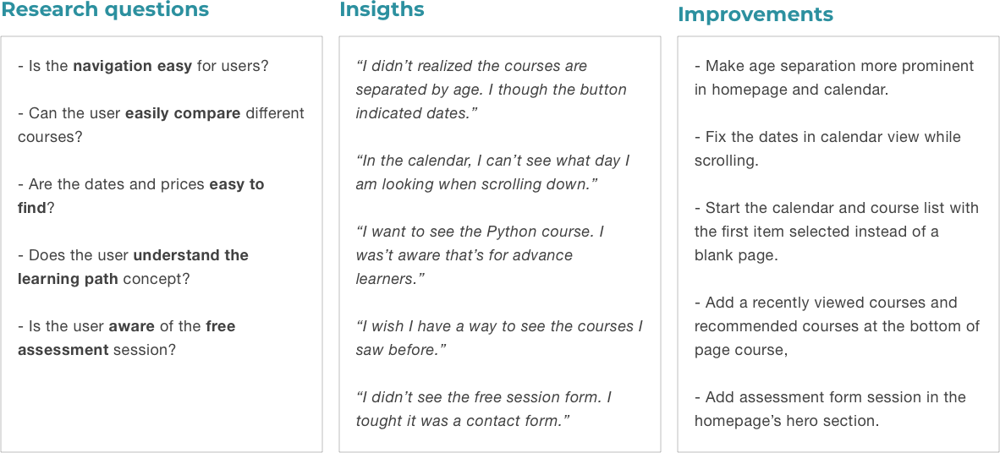

<ScrollableImage src="../images/geek-education/hifi-mockup-home-page.png" />

<TextColumns>
<TextColumn>

## Overview

- Role: Solo UX designer
- Tools: Sketch, Invision
- Timeline: December 2019

</TextColumn>
<TextColumn>

## Key outcomes

- UI and site map simplification for better navigation.
- Updated sections based on the existing Wordpress theme.

</TextColumn>
<TextColumn>

## Design methods

- User interviews
- Usability evaluation
- Competitor analysis
- Information architecture
- User interface prototyping

</TextColumn>
</TextColumns>

# The Goal

<TwoColumns>

<TwoColumnsImage src="../images/geek-education/goal.jpg" />

<TwoColumnsText>

How might we **help parents to choose extra-curricular activities** for their kids, that foster curiosity in young students and helps the founders to better **communicate the values** of the company?

</TwoColumnsText>
</TwoColumns>

## Main obstacles

- **Diverse client demographic:** potential clients include parents from Eastern and Western origins. Both groups have different ways to see education. Having limited access to interview families of eastern background, I supported my study interviewing non-parents users form this group, and in research studies related to this field.
- **Lack of a web developer:** Halfway through the project, the web developer committed to building the website left the project, so I had to implement the design ideas using only the components of the WordPress template used by the company.

## Motivations

During my work in the company as an instructor, I noticed the following issues from parents looking for coding classes:

- Many of them came to the academy requesting information that was already given on the website.
- Most of them had no knowledge of programming languages and were confused when taking the decision to enroll in a program.

I decided to take on this project to improve the experience of the customers and attract new clients.

<StickyNavigationHeader>

# The process

</StickyNavigationHeader>

<StickyNavigation>

<StickyNavigationSection name="Discover business goals">

# Business goals

I met with the company founders and gathered their thoughts and motivations using a Lean Canvas. This helped me understand the message that they wanted to send to their customers.

## Key metrics

- _"We want to increase registrations of students taking more than 1 level"_
- _"We need to group students, to have at least 3 students per class"_

## Unique value proposition

- **Fun class environment:** use of gamification to teach complex subjects.
- **Offer a learning path:** create an incremental learning plan for the students.
- **Care for students’ growth:** encourage self-learning.
- **Small classes:** promote participation and communication in the classroom.

## Problem definition

After a careful analysis of the academy website, discovering the business goals and the ongoing issues customers were having, I came to the following conclusions:

- The company **values were not visible** on the website.
- The website **does not guide users** to make decisions.
- Many parents call the office **asking for information that is already given** on the website.
- More than **90%** of the users **leave the site** after visiting the homepage.

</StickyNavigationSection>

<StickyNavigationSection name="User research">

# User research

I took on a **guerrilla research** mission. I made a list of the things I needed to know and documented my assumptions for each of them. I wanted to compare these assumptions with answers gathered from the real world.

<TwoColumns>

<TwoColumnsImage src="../images/geek-education/user-research.jpg" />

<TwoColumnsText>

- **Who** is looking for coding classes?
- **What** do they know about coding?
- **How** did their children get interested in coding?
- **How** long they want to commit to a program?
- **How** do they decide to sign up for classes?
- **Why** many of the students are boys?
- **What** do parents expect after completing a course?
- **When** do the parents think their children are prepared to learn to code?
- **How** often they want to attend classes?

</TwoColumnsText>
</TwoColumns>

After this, I recruited parents with kids, looking for coding classes. The session was divided in two parts: **Interview** (background, familiarity with tech, objectives and motivations) and **usability testing** (observe interaction with the current website)

## Findings

- Parents are not familiar with technology names and they need guidance to choose an appropriate course.
- They looked for an appropriate and friendly environment for learning, and qualified teachers.
- The main motivation is to find something that their kids would enjoy.
- They need to fit a course in their busy child’s schedule.
- Most of them already understand that learning to code is important, and they don’t need to be convinced.

## Personas

## User journey

</StickyNavigationSection>

<StickyNavigationSection name="Ideation">

# Ideation

## Competitor analysis

I wanted to understand what works for other companies. I asked the founders to give me a list of the sites they used for inspiration to build the website and to tell me what they liked about them. I also looked at other educational institutions’ websites to explore a better way to organize information. **I audited the information structure, layout, tone and navigation of five other institutions.** These are the highlights from that research:

## Current website: key findings

From the user interviews, I collected the usability test observations and analyzed what users liked and disliked.

## New site map

After a careful analysis of user needs, competitors’ websites and considering the company message, I decided to **simplify the content**. I reduced the number of sections, leaving the most useful information easy to access.

</StickyNavigationSection>

<StickyNavigationSection name="Low-fi prototype and test">

# Low fidelity prototype

## Sketches

With the information gathered during the usability testing, I invited the company founders to participate with me in developing new ideas using paper sketches. After the paper sketches, I created a low fidelity prototype to check and test the functionality of the new site. I presented the prototype to the company founders, and they were **very excited to see how clean and straightforward the new website looks.**

## Testing on low fidelity prototype

This version was meant to test how effectively the new website helps the user find a suitable course and enrol for an assessment session. After three iterations, the highlights of the changes made in the prototype were:

_[TODO: Spelling of insights below]_

</StickyNavigationSection>

<StickyNavigationSection name="Hi-fi mockups">

# High Fidelity mockups

<TwoColumns>

<TwoColumnsText reduced-padding>

<ScrollableImage
  full-width
  src="../images/geek-education/hifi-mockup-home-page.png"
/>

</TwoColumnsText>

<TwoColumnsText>

## Simplified Homepage

- A glance at the academy environment and a simplified way to see the course offerings separated by age. This **helps with the decision making process.**

- A new testimonial section to **gain the trust** of potential customers.

</TwoColumnsText>
</TwoColumns>

<TwoColumns>
    
<TwoColumnsText reduced-padding>

<ScrollableImage
  full-width
  src="../images/geek-education/hifi-mockup-course-details.png"
/>

</TwoColumnsText>

<TwoColumnsText>

## Well structured course details

- Course information simplified to make it **relevant to users**: course duration, non-technical curriculum overview, dates and price.
- Showcase of projects to give a **visual idea** of the projects developed in class.
- **Easy access** to a form to attend a **trial session.**

</TwoColumnsText>

</TwoColumns>

<TwoColumns>
    
<TwoColumnsText reduced-padding>

<ScrollableImage
  full-width
  src="../images/geek-education/hifi-mockup-calendar-view.png"
/>

</TwoColumnsText>

<TwoColumnsText>

## New calendar view

- The schedule is the main obstacle when selecting a course. With the calendar view, users **can see all available courses for the student’s age at once.**

</TwoColumnsText>

</TwoColumns>

</StickyNavigationSection>

</StickyNavigation>

# Take away

## Lessons learned

- Having to recruit and interview users was the most valuable lesson I got from it. **It took me a long time to look for users**, and that delay the construction of the new site. Next time I will **define a minimum amount of interviews to start the ideation process**, and then refine the ideas supported with extra interviews.

- A designer’s job is not only to create good experiences for users but also to **understand business goals**. This was very important for prioritizing the content.

## Next steps

- Due to changes in the company's priorities, the proposed design hasn't been implemented. **New metrics will be collected after the new site is live.**
